# Names: Isimbi Mushimire Iris
# ID: 27121
# PL assignment

# plsql-window-functions-Iris-Isimbi-
PL/SQL Window Functions Analysis for Rwanda Coffee Collective - Sales Performance and Customer Segmentation

## Business Problem
Analyze sales and customer data to identify top products per region, calculate running totals, assess month-over-month growth, and segment customers for targeted marketing.

## Database Schema

### Customers
| Column            | Type        | Description                                   |
|------------------|------------|-----------------------------------------------|
| customer_id (PK)  | SERIAL     | Unique identifier for each customer          |
| name              | VARCHAR    | Customer or business name                     |
| region            | VARCHAR    | Customer region                               |
| registration_date | DATE       | Date the customer registered                  |
| customer_type     | VARCHAR    | Type of customer (Individual, Cafe, Restaurant, Hotel) |

### Products
| Column      | Type      | Description                   |
|------------|----------|-------------------------------|
| product_id (PK) | SERIAL | Unique product identifier      |
| name       | VARCHAR  | Product name                   |
| category   | VARCHAR  | Product category               |
| price      | DECIMAL  | Selling price                  |
| cost       | DECIMAL  | Cost price                     |

### Transactions
| Column         | Type      | Description                              |
|----------------|----------|------------------------------------------|
| transaction_id (PK) | SERIAL | Unique transaction identifier          |
| customer_id (FK)    | INT    | Links to Customers table               |
| product_id (FK)     | INT    | Links to Products table                |
| sale_date           | DATE   | Date of transaction                     |
| quantity            | INT    | Number of items sold                     |
| amount              | DECIMAL| Total amount of the transaction          |
| payment_method      | VARCHAR| Payment method used (Cash, Bank, Mobile)|

---

## Queries Implemented

1. **Top 5 Products per Region** – Using `RANK()`, `DENSE_RANK()`, `PERCENT_RANK()`  
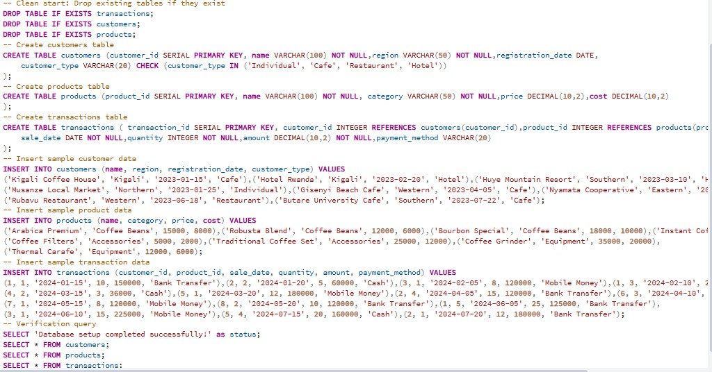
2. **Running Monthly Sales Totals** – Using `SUM() OVER()` 
 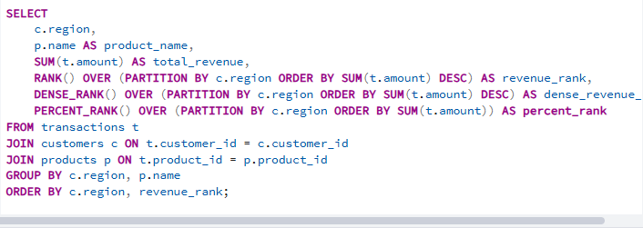
3. **3-Month Moving Averages** – Using `AVG() OVER()` 
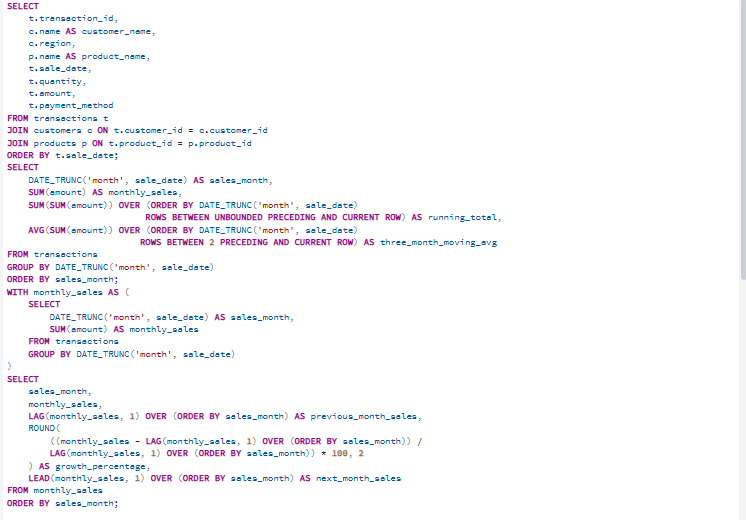 
4. **Month-over-Month Growth** – Using `LAG()` and `LEAD()` 
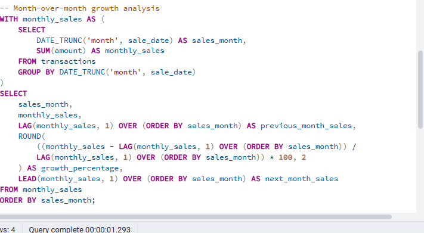 
5. **Customer Segmentation** – Using `NTILE(4)` and `CUME_DIST()`
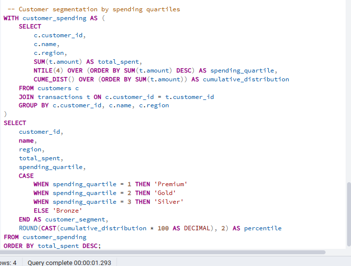

## Screenshots
All screenshots are saved in the  screenshots folder.  
Examples:  
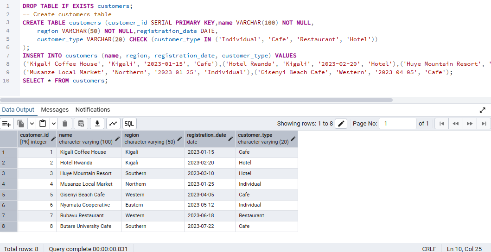 – customers table creation  
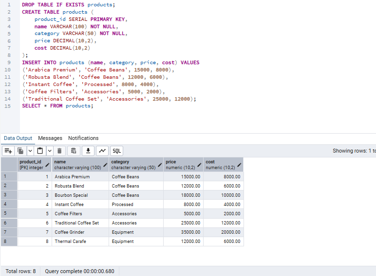 – Products table creation 
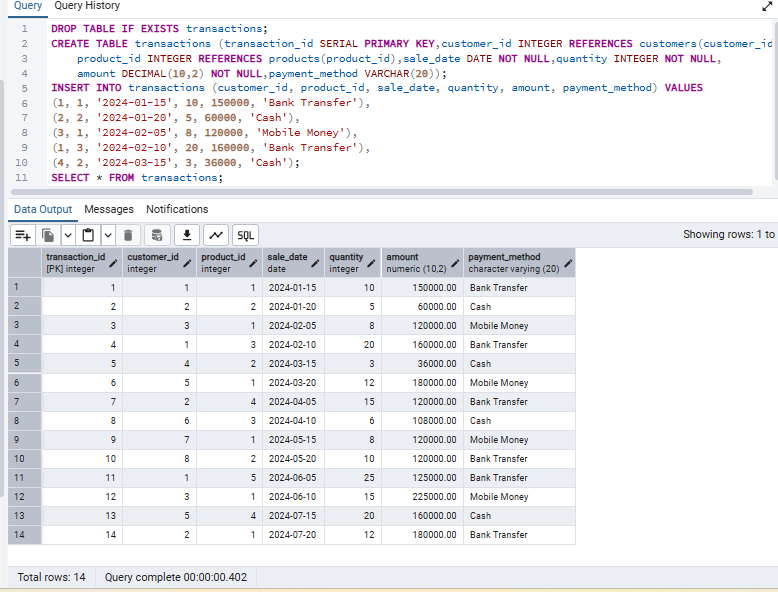 – Transactions table creation 
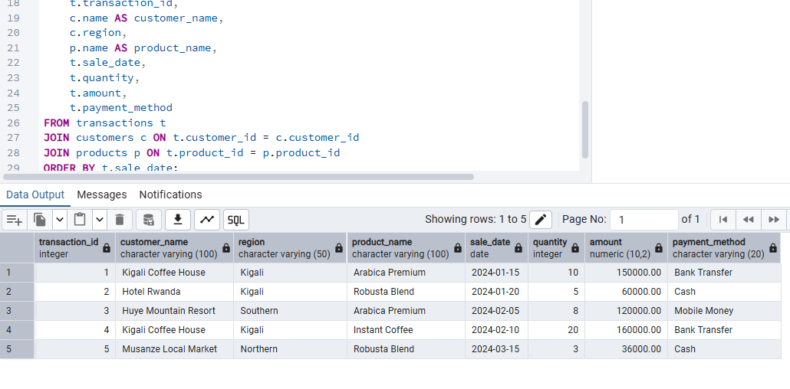 - Joined transactions
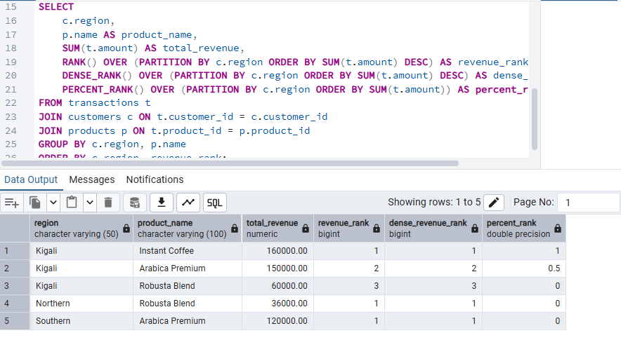   – Top products ranking
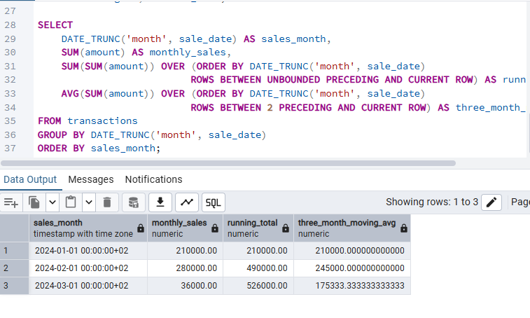 – Running monthly totals  
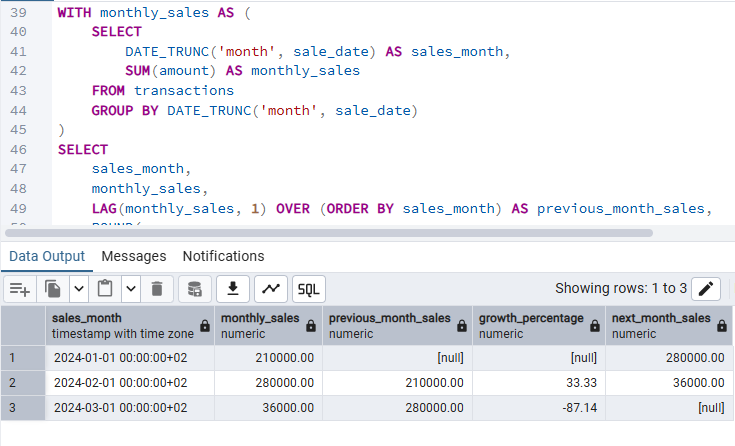  – Month-over-month growth 
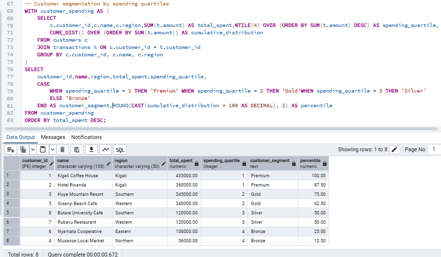 – Customer segmentation

## Results Analysis

### Descriptive
- Kigali region generated the highest revenue, led by “Arabica Premium”.  
- Monthly sales showed an upward trend with a slight dip in February.  
- Top 25% of customers labeled “Premium”, bottom 25% labeled “Bronze”.  

### Diagnostic
- High revenue in Kigali due to concentration of cafes and hotels.  
- March growth attributed to repeat purchases and bulk orders.  
- Customer segmentation shows spending patterns vary by customer type and region.

### Prescriptive
- Focus marketing campaigns on high-revenue regions (Kigali).  
- Offer loyalty programs to retain Premium and Gold customers.  
- Plan inventory according to moving average trends.  
- Target Bronze/Silver customers with promotions to increase revenue.  

## References
1. Oracle PL/SQL Documentation – https://docs.oracle.com/en/database/oracle/oracle-database/  
2. PostgreSQL Window Functions – https://www.postgresql.org/docs/current/functions-window.html  
3. SQL Shack – Window Functions Tutorial  
4. Mode Analytics – SQL Window Functions  
5. Stack Overflow discussions on RANK, NTILE  
6. Academic paper: “Sales Analytics Using SQL Window Functions”  
7. Medium article: “Customer Segmentation in SQL”  
8. TutorialsPoint – SQL Aggregate & Ranking Functions  
9. Kaggle example datasets for retail sales analytics  
10. Course lecture notes  

## Academic Integrity
All sources were properly cited. Implementations and analysis represent original work. No AI-generated content was copied without attribution or adaptation.

## Repository Link
https://github.com/irisisimbi/plsql-window-functions--Iris---Isimbi-.git
 